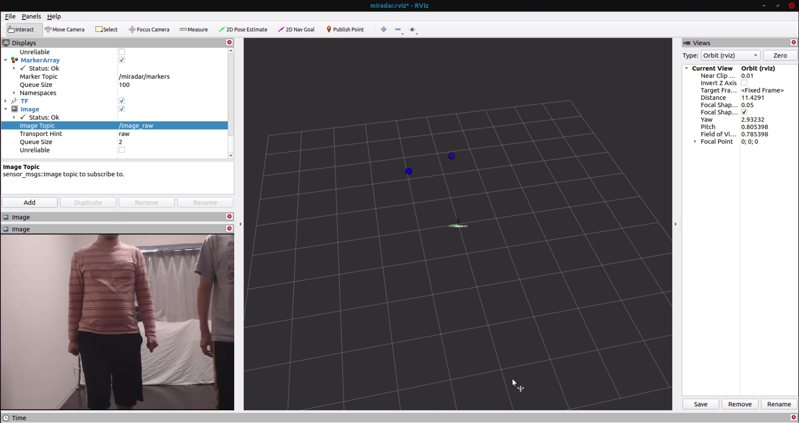
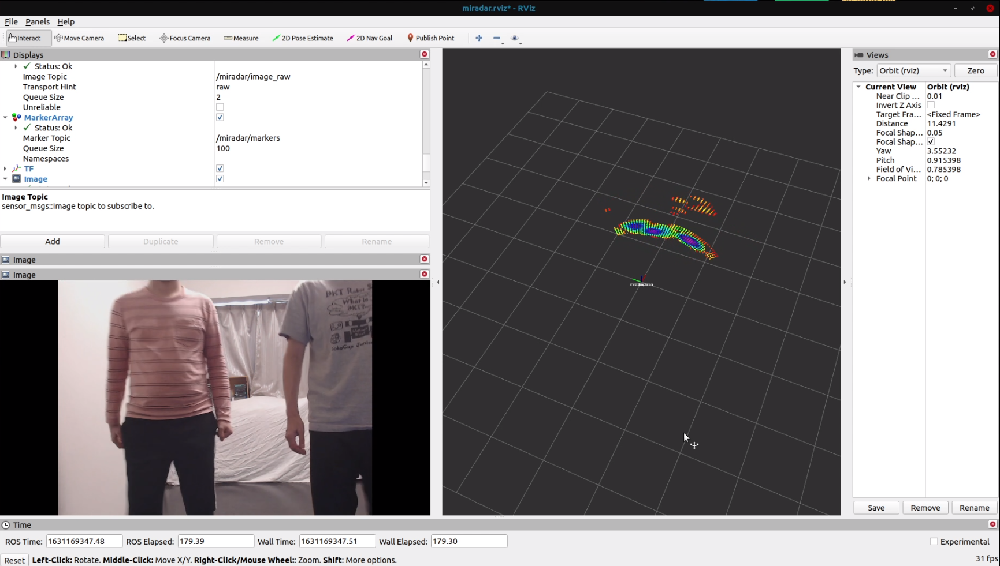
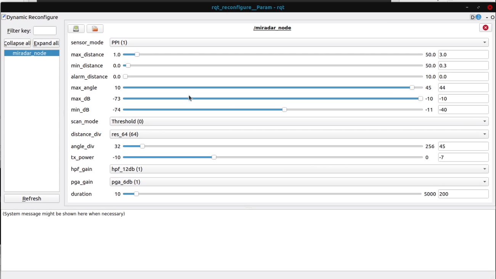

# miradar_node


ROS Node for miradar12e new firmware.
Parameters are available to set via dynamic_reconfigure.
CI is done in local jenkins environment.


## Acknowledgements
The original of this ROS Node was created by Quibitech Inc.  
The link is as follow.  
https://github.com/QibiTechInc/miradar_ros1_pkgs

## Launch
```bash
roslaunch miradar_node miradar_rviz.launch
```
### PPI Mode


### Map Mode



## ROS Node
### miradar_node
ROS Node for converting miradar12e to ROS.

```bash
rosrun miradar_node miradar_node _devicename=/dev/ttyACM0
```

### ppi_visualizer.py
PPI data rviz visualization node.
```bash
rosrun miradar_node ppi_visualizer.py
```

## Building in non ROS environment
### Build
build src/maincore.cpp.
```bash
g++ -std=c++11 maincore.cpp -o miradar
```
### Execution
```bash
./miradar [device file] [sensor mode]
```
sensor mode
0 : halt
1 : PPI
2 : Map
e.g.
```bash
./miradar /dev/ttyACM0 1
```


## Topic
## /miradar/ppidata : miradar_node/PPIData
ROS Topic to retreive ppidata.
This topic will be sent only the sensormode is in PPI Mode.

## /miradar/image_raw : sensor_msgs/Image
ROS Topic to retreive mapdata.
This topic will be sent only the sensormode is in Map mode.  　　

## /miradar/markers : visualization_msgs/MarkerArray
ROS Topic to visualize PPI data in RVIZ.
The red marker means strong signal(db), and the blue marker means weak signal.

## /miradar/scan : sensor_msgs/LaserScan
ROS Topic of the radar scan in LaserScan format.

## /miradar/points : sensor_msgs/PointCloud2
ROS Topic of the radar scan in pointclouds.


## ROS Parameter
### devicename : str
setup the device name as devicefile.
例:
Linux
```bash
rosrun miradar_node miradar_node _devicename:=/dev/ttyACM0
```
WSL1
```bash
rosrun miradar_node miradar_node _devicename:=/dev/ttyS7
```


## Dynamic Reconfigure Param


### sensor_mode : Halt, PPI, Map
Choose the sensor mode to halt(0), ppi(1), and map(2).

### max_distance : int
Choose the max distance of the sensor range.

### min_distance : int
Choose the min distance of the sensor range.

### alarm_distance : int
Choose the alarm distance of the sensor range.

### max_angle : int
Choose the max angle of the sensor range.

### min_angle : int
Choose the min angle of the sensor range.

## distance_div : int
Choose the resolution of the map in distance direction.  Valid parameters are {32, 64, 128, 256}.

## angle_div : int
Choose the resolution of the map in angle direction.


### max_dB : int
Choose the max db of the sensor sensitivity.

### min_dB : int
Choose the min db of the sensor sensitivity.

### tx_power : int
Choose the power of the TX signal via RS485 communication. Default value recommended.

### hpf_gain : 0db, 12db, 18db
Choose the hpf gain.

### pga_gain : 0db, 6db, 12db, 18db, 24db
Choose the pga gain.

### duration : int
Choose the sensor response time in ms.
